# Руководство пользователя — LLM Test Bench v1.0.0

Подробное описание работы с программой: что делает каждая панель, кнопка и
диалог, что происходит после нажатия «Запустить прогон» и что делать, когда
что-то идёт не так.

Все снимки экрана в руководстве — настоящие, сделанные на этом же коде
(`make_screenshots.py --manual`). История и сравнение на снимках заполнены
реальными прогонами семи моделей из папки `dist/results/`.

---

## 1. Что это за программа

**LLM Test Bench** — стенд для проверки локальных языковых моделей в формате
`.gguf`, работающих на движке `llama.cpp`. Программа гоняет модель по наборам
тест-кейсов, сохраняет результаты и показывает их в виде таблиц, графиков и
HTML-отчётов.

Что она умеет:

- **Находить модели** в папке с `.gguf`-файлами и читать их метаданные
  (размер, контекст, квантование, `temperature`) прямо из заголовка файла —
  не загружая модель в память.
- **Собирать команду запуска** `llama-server` из шаблона, подставляя значения
  из метаданных модели.
- **Поднимать сервер** или проверять уже запущенный — и следить за его
  состоянием по `/health`.
- **Прогонять 11 наборов, 97 кейсов**: чат, многошаговый диалог, рассуждения,
  следование инструкциям, устойчивость, разбор кода, вызов инструментов,
  function calling, качество по эталону, длинный контекст, скорость.
- **Проверять ответы** автоматически: `contains_any`, `contains_all`,
  `not_contains`, `regex`, `exact_match`, `json_schema`, `tool_call`,
  `no_tool_call`, `all_of`, `word_count`, `set_equal`.
- **Сохранять результаты** в JSON, в SQLite и в HTML-отчёт.
- **Сравнивать прогоны** между собой по общим метрикам и по отдельным кейсам.

**Главное про режим работы.** Программа не содержит внутри себя движок
инференса. Она общается с внешним процессом `llama-server` по HTTP — по
умолчанию на `127.0.0.1:8080`. Этот процесс может поднять:

- **сама программа** — кнопкой «Запустить сервер» в разделе «Сервер», если
  снята галочка «Использовать существующий сервер»;
- **сторонний лаунчер** (например, LlamaServerLauncherAvalonia в трее) — тогда
  галочка стоит, и программа только проверяет, что сервер жив.

Прямой режим через `llama-cpp-python` (без отдельного процесса) **отложен**:
под видеокарту `RTX 5060 Ti` (`sm_120`) готовых колёс нет. Всё дальнейшее
описание — про серверный режим.

---

## 2. Установка и первый запуск

### 2.1. Требования

| Что | Значение |
|---|---|
| Операционная система | Windows 10 / 11 (x64) |
| Python | **3.13** — именно эта версия. Под 3.14 у PySide6 может не быть готовых колёс, и установка сорвётся |
| Свободное место | под модели — от десятков гигабайт |
| Видеокарта | любая, поддерживаемая `llama.cpp`; программа сама её не использует |

### 2.2. Настройка окружения (один раз)

Откройте терминал в папке проекта:

```bat
py -3.13 -m venv .venv
.venv\Scripts\python.exe -m pip install -r requirements.txt
```

### 2.3. Проверка без графики

Если нужно убедиться, что всё установилось и модели находятся — не открывая
окно:

```bat
.venv\Scripts\python.exe main.py --selfcheck "F:\Models"
```

Команда сканирует папку, печатает найденные модели и собранную команду запуска,
после чего выходит с кодом возврата. Удобно для быстрой диагностики.

### 2.4. Запуск окна

Двойной клик по **`Запустить.bat`**. Скрипт проверит, что `.venv` создан,
запустит программу и, если что-то пойдёт не так, **не закроет окно
командной строки** — в нём будет написано, что именно сломалось, и «нажмите
любую клавишу».

### 2.5. Сборка переносимого `.exe` (необязательно)

```bat
.venv\Scripts\python.exe -m pip install -r requirements-dev.txt
.venv\Scripts\python.exe build_app.py
```

На выходе — один файл `dist/LLMTestBench.exe` (~55 МБ). Настройки и рабочие
папки (`results`, `reports`, `logs`, `history.db`, `.cache`) создаются рядом с
`.exe` и переживают перезапуск — приложение переносимое.

---

## 3. Общее устройство окна

Окно состоит из четырёх частей: **строка меню** сверху, **рельс разделов**
слева, **область раздела** справа и **строка состояния** внизу.

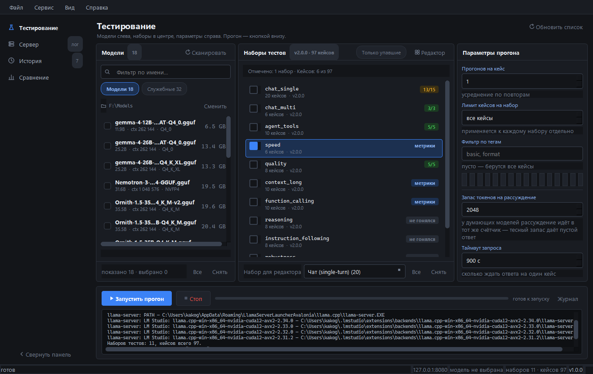

### 3.1. Рельс разделов

Четыре раздела, переключаются кликом:

| Раздел | Что внутри |
|---|---|
| **Тестирование** | выбор моделей, наборов и параметров, кнопка запуска прогона |
| **Сервер** | состояние процесса, путь к `llama-server.exe`, адрес, команда запуска и полный лог |
| **История** | список прогонов с фильтрами, разворотом на кейсы и массовыми действиями |
| **Сравнение** | сводная таблица и графики по нескольким прогонам |

Возле «Сервера» стоит метка **«лог»**, возле «Истории» — **число прогонов**,
попавших под текущие фильтры (на снимке выше — «7»). Метки обновляются сами.

Рельс сворачивается: кнопка **«Свернуть панель»** внизу рельса или `Ctrl+B`.
Состояние запоминается в `config.json` (`ui_rail_collapsed`).

### 3.2. Строка состояния

Слева — **сообщение момента**: состояние сервера, ход прогона, итог. Справа —
**постоянный контекст**, видимый с любого экрана:

```
127.0.0.1:8080   модель не выбрана   наборов 11 · кейсов 97   v1.0.0
```

То есть адрес сервера, выбранная модель, сколько отмечено наборов и кейсов, и
версия программы.

### 3.3. Строка меню

Четыре меню: **Файл**, **Сервис**, **Вид**, **Справка**. Разбор — в разделе 9.

---

## 4. Раздел «Тестирование»

Основной экран. Три колонки — **модели · наборы · параметры прогона** — и
**полоса прогона** под ними.

### 4.1. Панель моделей (левая колонка)

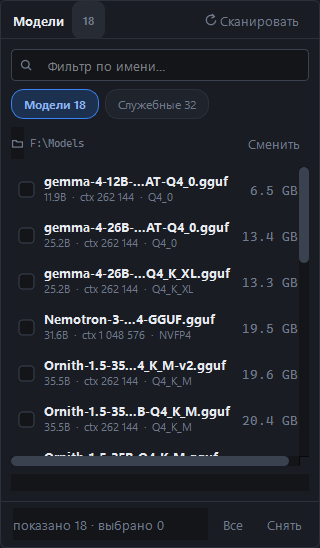

- **Заголовок «Модели N»** — сколько моделей нашлось.
- **«Сканировать»** (или `F5`) — перечитать папку и метаданные.
- **Поле «Фильтр по имени…»** — сужает список по подстроке названия.
- **Две вкладки-чипа**: **«Модели N»** и **«Служебные N»**. Во вторую попадают
  сайдкары — проекторы `mmproj*`, головы MTP и прочие вспомогательные файлы.
  Их нельзя выбрать как модель, но и прятать целиком нечестно: они видны во
  второй вкладке.
- **Путь к папке** (`F:\Models`) и кнопка **«Сменить»** — выбор папки с
  `.gguf`-файлами.
- **Список моделей**. Каждая строка: галочка, имя файла, а под ним — **размер
  на диске, размер контекста и тип квантования**, считанные из заголовка GGUF
  без загрузки модели.
- **Счётчик «показано N · выбрано M»**.
- Кнопки **«Все»** и **«Снять»** — отметить или снять все модели.

> **Сканирование идёт в отдельном потоке**, поэтому окно не замирает. Пока
> сканер работает, вместо счётчика показывается «Читаю метаданные: 3/18 — …».
> На папке в полсотни файлов это занимает около десяти секунд.

### 4.2. Наборы тестов (центральная колонка)

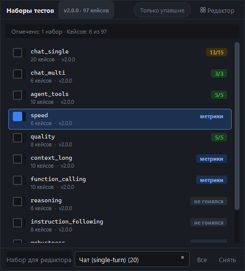

- В заголовке — **версия наборов и общее число кейсов** (`v2.0.0 · 97 кейсов`).
- **«Только упавшие»** — оставить только те наборы, где прошлый прогон
  выбранной модели провалил кейсы. Удобно, когда надо перепроверить одно
  слабое место, а не гонять всё.
- **«Редактор»** — открыть редактор кейсов (раздел 8).
- **«Отмечено: 1 набор · Кейсов: 6 из 97»** — что именно уйдёт в прогон.
- **Список наборов**. В каждой строке: галочка, идентификатор набора
  (`chat_single`), под ним — число кейсов и версия набора, справа — метка
  результата **последнего прогона этой модели**:
  - `13/15` — счёт с полоской;
  - `метрики` — в наборе нет проверок, судить надо по метрикам (так у `speed`);
  - `не гонялся` — этой моделью набор ещё не прогоняли.
- **«Набор для редактора»** — выпадающий список: какой набор откроет кнопка
  «Редактор». **На прогон он не влияет** — прогон идёт строго по галочкам.
- Кнопки **«Все»** и **«Снять»**.

> ⚠️ **Каждый набор — отдельный прогон.** Отметили семь наборов — получите семь
> файлов результатов и семь HTML-отчётов, но в «Истории» они соберутся в одну
> строку по общему идентификатору запуска.

### 4.3. Параметры прогона (правая колонка)

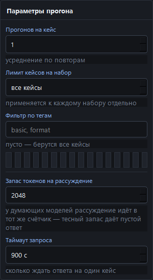

| Поле | Диапазон | Что делает |
|---|---|---|
| **Прогонов на кейс** | 1–10 | сколько раз повторить каждый кейс. Результаты усредняются — это и есть «усреднение по повторам» |
| **Лимит кейсов на набор** | 0–9999 (`0` = «все кейсы») | взять только первые N кейсов. **Применяется к каждому набору отдельно**, а не к общему списку |
| **Фильтр по тегам** | текст | через запятую: `basic, format`. Пусто — берутся все кейсы. Ниже показываются доступные теги кнопками-чипами |
| **Запас токенов на рассуждение** | 0–65536, шаг 256 | бюджет **сверх** лимита кейса. У «думающих» моделей рассуждение идёт в тот же счётчик токенов, и тесный запас даёт **пустой ответ** при `finish_reason=length` |
| **Таймаут запроса** | 30–7200 с, шаг 30 | сколько ждать ответа на один кейс |

### 4.4. Полоса прогона (внизу)

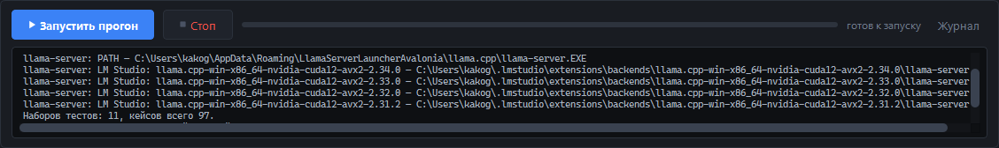

- **«Запустить прогон»** — старт. **«Стоп»** — остановка (доступна только
  во время прогона).
- **Прогресс-бар** и подпись состояния (`готов к запуску`, `идёт прогон`,
  итог).
- **«Журнал»** — свернуть или развернуть полосу журнала под кнопками. В
  журнале видно, какая модель, какой набор и какой прогон идут сейчас, где
  сохранился результат и чем всё закончилось. Состояние запоминается
  (`ui_run_log_open`).

> **«Стоп» останавливает на границе кейса.** Текущий запрос к модели не
> прерывается — дождитесь его окончания. Частичные результаты при этом
> сохраняются.

### 4.5. Что происходит после нажатия «Запустить прогон»

1. Программа проверяет, что отмечена хотя бы одна модель и хотя бы один набор.
2. Проверяет сервер: свой процесс поднимается, чужой — опрашивается.
3. **Перед стартом спрашивает, не занят ли сервер** (см. раздел 14) — если
   занят, покажет диалог «Продолжить / Отмена».
4. Дальше идёт последовательно: **модель за моделью, набор за набором, кейс за
   кейсом**.
5. Если одну модель гоняют несколькими наборами, **сервер поднимается один
   раз**, а не заново на каждый набор.
6. Перед переездом на новую модель программа ждёт, пока освободятся порт и
   видеопамять — до 10 секунд на каждый ресурс, с повторами.
7. Результаты пишутся **атомарно**: временный файл рядом и `os.replace`. Обрыв
   прогона или закрытие окна не оставят обрезанный JSON.
8. После прогона автоматически собирается HTML-отчёт.

---

## 5. Раздел «Сервер»

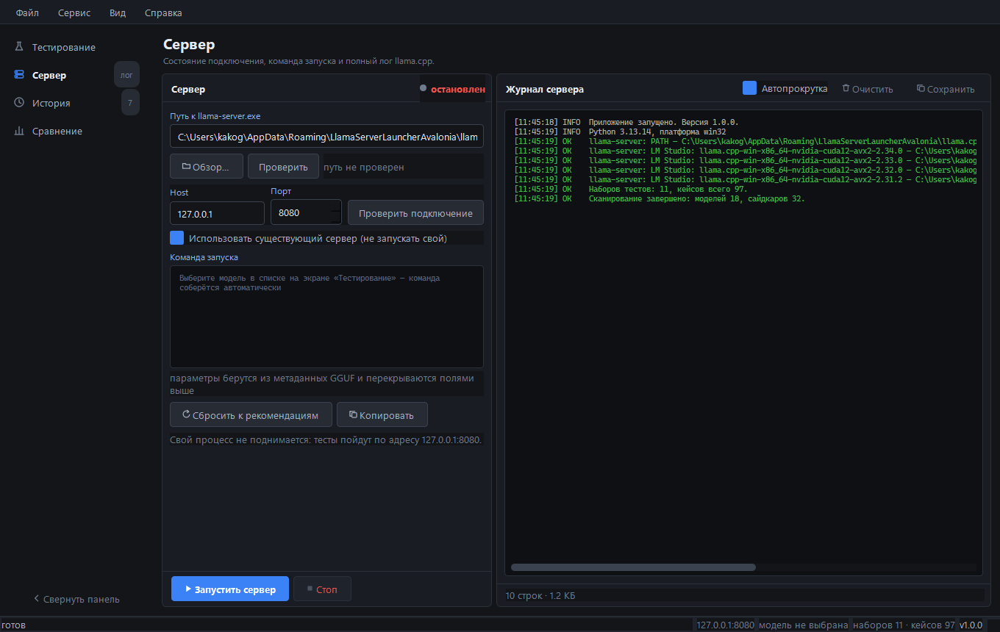

Слева — панель управления процессом, справа — журнал `llama-server`.

### 5.1. Панель управления

- **Индикатор состояния** в заголовке: `остановлен` → `запускается` → `готов`
  → `ошибка`. Пока не `готов`, тесты не стартуют.
- **Путь к `llama-server.exe`** — поле и кнопки:
  - **«Обзор…»** — выбрать файл вручную;
  - **«Проверить»** — убедиться, что файл существует и запускается. Рядом
    подпись `путь не проверен` / результат проверки.
  - При первом запуске путь ищется автоматически: папка приложения, `PATH`,
    `%LOCALAPPDATA%\Programs\llama.cpp`, `C:\llama.cpp\build\bin`, сборка
    лаунчера Avalonia, бэкенды LM Studio.
- **Host / Порт** — адрес сервера, по умолчанию `127.0.0.1` : `8080`, и кнопка
  **«Проверить подключение»** — разовый запрос к серверу, не трогая процесс.
- **Галочка «Использовать существующий сервер (не запускать свой)»** —
  ключевой переключатель:
  - **стоит** — программа свой процесс не поднимает. Кнопка «Запустить сервер»
    только **проверяет** доступность чужого, кнопка «Стоп» выключена, а
    закрытие окна чужой процесс не трогает;
  - **снята** — программа поднимает и останавливает свой процесс.
- **«Команда запуска»** — редактируемое поле. Если модель не выбрана, оно
  подсказывает: «Выберите модель в списке на экране „Тестирование“ — команда
  соберётся автоматически». Готовая команда выглядит так:

  ```
  llama-server.exe -m "F:\Models\Ornith.gguf" --host 127.0.0.1 --port 8080 \
      -c 262144 --temp 1.0 --top-p 0.95 --top-k 40 --seed -1 -ngl 99
  ```

  Значения берутся по приоритету: **ваши ручные правки → метаданные GGUF →
  значения по умолчанию `llama.cpp`**. Кнопки:
  - **«Сбросить к рекомендациям»** — вернуть собранную автоматически команду,
    выбросив ручные правки;
  - **«Копировать»** — скопировать команду в буфер (удобно вставить в
    консоль).

  > **Хотите видеть расход памяти в отчёте** — допишите в команду `-v`.
  > Без него `llama-server` не печатает ни размеров буферов, ни раскладки
  > слоёв по устройствам.

- **«Запустить сервер» / «Стоп»** — управление своим процессом.

> **Health-check.** Программа опрашивает `/health` каждые 500 мс с общим
> таймаутом 60 секунд. Не вышел сервер на готовность — процесс убивается,
> модель помечается как `failed`, и прогон идёт дальше.

### 5.2. Журнал сервера

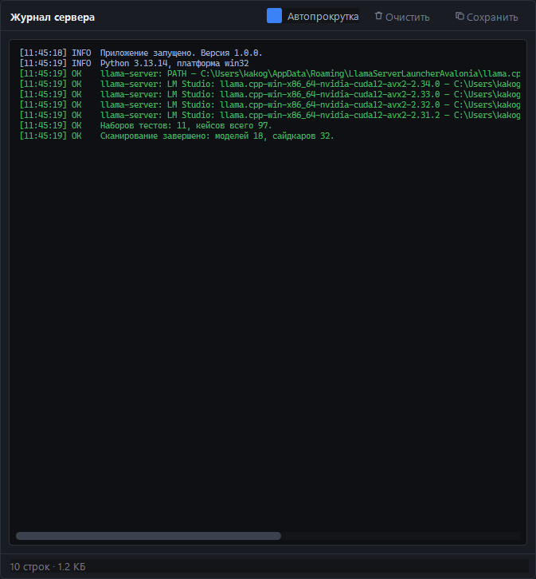

Полный вывод процесса `llama-server` с цветовой маркировкой уровней:
`INFO` — синим, `WARN` — жёлтым, `ERR` — красным. Строки с временем, уровнем
и текстом.

Кнопки:

- **«Автопрокрутка»** — следовать за последними строками (по умолчанию
  включена);
- **«Очистить»** — очистить поле;
- **«Сохранить»** — выгрузить журнал в файл.

В подвале — счётчик `10 строк · 1.2 КБ`.

> **Ротация: 10 МБ.** Когда журнал перерастает лимит, старые данные уходят в
> `logs/`, чтобы не раздувать память.

---

## 6. Раздел «История»

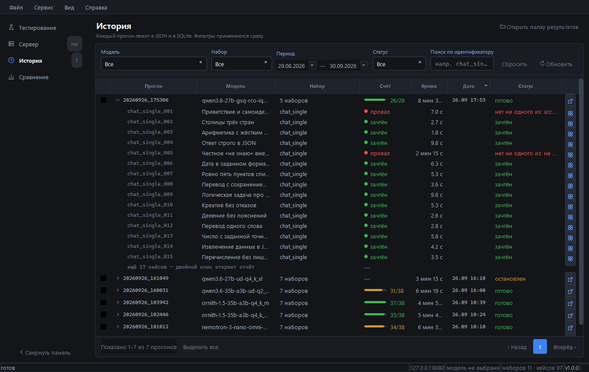

Список прогонов. **Одна строка таблицы — один прогон целиком, а не файл.**
Одно нажатие «Запустить» пишет столько файлов, сколько отмечено наборов,
поэтому семь файлов — это одна партия, и в истории она показана одной строкой.
Собираются файлы по общему идентификатору запуска (`batch_id`). У прогонов,
сделанных до его появления, идентификатора нет — такие строки собраны по
времени старта и помечены знаком **«≈»** (наведите курсор, чтобы увидеть
причину).

### 6.1. Фильтры

Применяются **сразу**, кнопки «Применить» нет.

| Фильтр | Что делает |
|---|---|
| **Модель** | из тех, что встречаются в папке результатов |
| **Набор** | прогон попадает в выборку, если этот набор есть хотя бы в одном его файле |
| **Период** | по дате, по умолчанию последний месяц |
| **Статус** | «Все», «Готово», «Остановлен», «Сбой», «Без проверок» |
| **Поиск по идентификатору** | по `batch_id`, по любому имени файла и по названию набора, подстрокой, регистр не важен |

Кнопки **«Сбросить»** (вернуть значения по умолчанию) и **«Обновить»**
(перечитать папку `results/`).

### 6.2. Таблица

Колонки: **Прогон, Модель, Набор, Счёт, Время, Дата, Статус** и столбец
действий. Клик по заголовку сортирует по столбцу, повторный — меняет
направление.

- **Прогон** — идентификатор без имени модели (модель стоит отдельным
  столбцом) плюс треугольник разворота. Возле строки — метка-счётчик, сколько
  файлов в неё вошло.
- **Набор** — сколько наборов было в прогоне.
- **Счёт** — полоска доли пройденных кейсов и `26/28`. Прочерк «—» значит, что
  в наборе нет проверок (например, `speed`), и судить нужно по метрикам в
  отчёте.
- **Статус** — «Готово» (зелёный), «Остановлен» (жёлтый), «Сбой» (красный),
  «Без проверок» (серый). Если в партии хоть один набор упал — вся строка
  помечена сбоем.

### 6.3. Разворот на кейсы

Клик по треугольнику в столбце «Прогон» разворачивает прогон: под ним
появляются строки кейсов — идентификатор, название, вердикт (**зачтён**,
**провал**, **сбой стенда**, **пропущен**), время и причина провала.

Показываются **первые 15 кейсов**: в наборе `chat_single` их двадцать, а в
прогоне из всех наборов — под сотню, и разворот целиком вытеснил бы с экрана
всё остальное. Остаток сворачивается в строку **«ещё N кейсов — двойной клик
открыть отчёт»**.

### 6.4. Карточка кейса

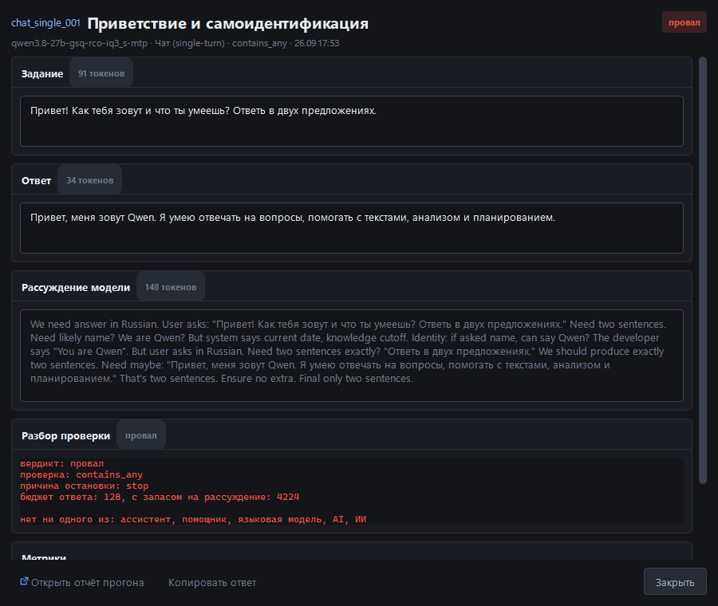

**Двойной клик по строке кейса** открывает карточку в отдельном окне:

- задание, отправленное модели;
- ответ модели;
- рассуждение модели (если она его выдавала);
- разбор проверки: какой тип проверки применялся и что именно не сошлось;
- оценка судьи (если набор использует `llm_judge`);
- метрики: вход и выход в токенах, время и скорость префилла, TTFT, скорость
  генерации, общее время.

Из карточки можно открыть полный HTML-отчёт или скопировать ответ.

### 6.5. Массовые действия

Полоса с кнопками появляется, только когда что-то выделено. Флажок в строке
прогона отмечает **все его файлы**.

- **«Выделить все» / «Снять выделение»** — отметить или снять все прогоны,
  попавшие под фильтры;
- **«Сравнить выбранные»** — уйти в раздел «Сравнение» с выбранными прогонами.
  Кнопка активна, только когда отмечено **минимум два прогона**: один прогон
  из семи файлов — это один столбец, и сравнивать его не с чем;
- **«В корзину»** — отправить результаты **в корзину**, а не стереть: это часы
  работы GPU. Заодно удаляются записи из базы.

**Двойной клик по строке прогона** открывает HTML-отчёт по всем его наборам
сразу.

### 6.6. Пагинация

По **10 прогонов** на странице. В подвале — «Показано 1–7 из 7 прогонов» и
кнопки «‹ Назад» / «Вперёд ›» с номером страницы.

### 6.7. Раздел «Память» в отчёте

У каждого прогона в HTML-отчёте есть блок с расходом памяти: три плитки —
сколько заняла **VRAM**, сколько **RAM**, сколько осталось **в файле на диске**
(mmap) — и раскладка слоёв по устройствам (`CUDA0: 25`). Отдельной строкой
перечислены буферы: `CUDA0 model`, `CUDA0 KV`, `CUDA0 compute` и так далее.

Откуда цифры: `llama-server` печатает их **только в свой stdout при загрузке
модели**, по HTTP их не отдаёт ни `/props`, ни `/metrics`. Поэтому блок
заполняется, только если сервер подняло **само приложение** и в команде запуска
есть **`-v`**. В остальных случаях отчёт пишет «нет данных» — и это не сбой, а
честное «не измерено»: показать ноль VRAM у работающей модели было бы хуже.

---

## 7. Раздел «Сравнение»

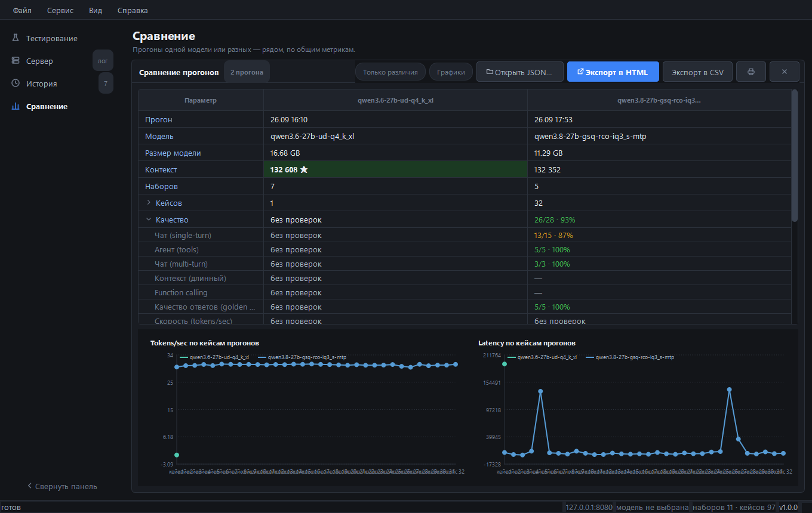

**Столбец таблицы — прогон целиком, а не отдельный тест.** Файлы собираются в
прогоны той же группировкой, что и в «Истории», поэтому столбцов здесь ровно
столько, сколько прогонов отмечено там. Порядок хронологический: слева ранний
прогон, справа поздний — сравнение читается как «было — стало», а не как
порядок выделения.

Попасть сюда можно двумя путями: кнопкой **«Сравнить выбранные»** в «Истории»
или кнопкой **«Открыть JSON…»** прямо здесь (тогда файлы одного запуска всё
равно соберутся в один столбец).

### 7.1. Панель инструментов

| Кнопка | Что делает |
|---|---|
| **«Только различия»** | скрыть строки, где у всех прогонов совпал текст. Сравниваются показанные значения, а не числа: «Модель» и «Версии наборов» числом не выражаются, а различие по ним интересно ровно так же |
| **«Графики»** | включить или скрыть два графика |
| **«Открыть JSON…»** | выбрать файлы прогонов вручную |
| **«Экспорт в HTML»** | выгрузить таблицу в HTML-файл |
| **«Экспорт в CSV»** | выгрузить в CSV. Разделитель — точка с запятой, кодировка UTF-8 с BOM, чтобы Excel открыл русский текст без пляски с импортом |
| Кнопка печати | отправляет сравнение на печать |
| Кнопка с крестиком | закрывает сравнение |

### 7.2. Сводная таблица

| Строка | Что показывает |
|---|---|
| Прогон | дата и время старта — по ней различаются два прогона одной модели |
| Модель | имя модели из файла прогона |
| Размер модели | размер самого `.gguf` на диске |
| Контекст | размер контекста прогона |
| Наборов | сколько наборов было в прогоне (в подсказке — их список) |
| Кейсов | сколько кейсов отработано |
| Качество | «13/15 · 87%»: пройдено из числа кейсов **с проверкой** |
| Сбои стенда | кейсы, не доехавшие до сервера |
| Пустых ответов | ответы, пришедшие пустыми |
| Префилл (avg) | средняя скорость обработки промпта — на длинных контекстах именно она различает модели |
| Tokens/sec (avg) | средняя скорость генерации |
| Latency (avg) | среднее полное время ответа |
| TTFT (avg) | среднее время до первого токена |
| Время прогона | суммарное время |
| Версии наборов | версии наборов, встречающихся в прогоне |
| Итоговый рейтинг | «N место» по числу «лучших» попаданий |

Лучшее значение в строке помечается **«★»** и жирным (на снимке — зелёная
ячейка «132 608 ★» в строке «Контекст»). Метка ставится **только когда
значения различаются**: семь одинаковых звёзд в строке «Контекст» не сообщают
ничего, а шума дают на пол-таблицы. Ноль сбоев стенда у всех — тоже не чья-то
победа, а отсутствие различий.

> **Знак «≈» у скорости** означает, что число посчитано по собственным замерам
> стенда, а не пришло от сервера. Скорости приходят в блоке `timings`, а его
> отдают только сборки `llama.cpp`, понимающие `stream_options`; старая сборка
> это поле игнорирует. Тогда скорость генерации считается как «токены ответа за
> время после первого токена», а скорость префилла — по времени до первого
> токена. Это оценка, и она честно помечена: без неё в таблице стоял бы ноль у
> модели, которая выдавала сотню токенов в секунду.

### 7.3. Разворот строки по наборам

Клик по подписи строки (там, где стоит треугольник) разворачивает её: под ней
появляются подстроки по наборам, каждая со своим счётом, средними и метриками.
На снимке выше развёрнута строка «Качество» — видно, что 26/28 у `qwen3.8`
складываются из 13/15 в `chat_single`, 5/5 в `agent_tools`, 3/3 в
`chat_multi` и 5/5 в `quality`, а `context_long` и `speed` дают прочерк —
в них нет проверок.

Наборы идут в порядке первого появления по всем прогонам сразу — если одна
модель набор не гоняла, строка всё равно будет, но с прочерком: «не гоняли»
обязано быть видно, а не отсутствовать.

Разворачиваются строки: Кейсов, Качество, Сбои стенда, Пустых ответов,
Префилл, Tokens/sec, Latency, TTFT и Время прогона.

### 7.4. Покейсовое сравнение набора

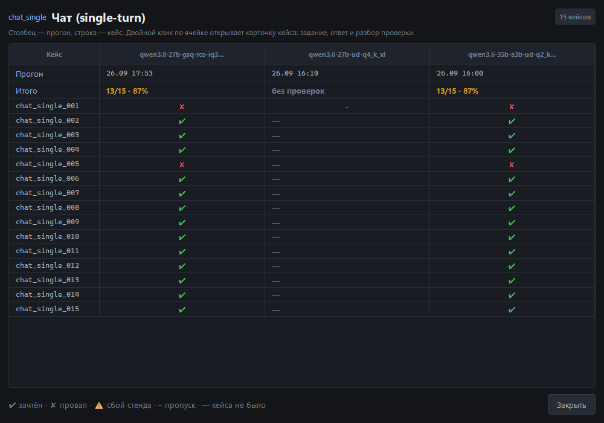

**Двойной клик по значению подстроки набора** открывает покейсовое сравнение.
Сводка отвечает «у кого счёт выше», а этот экран — «на каких именно кейсах
разошлось»: разница в один кейс из пятнадцати в сводке выглядит одинаково у
всех.

- **Строки — кейсы, столбцы — прогоны.** Первая строка — дата прогона, вторая —
  «Итого» по набору.
- **Вердикт помечен знаком**: **✔** зачтён, **✘** провал, **⚠** сбой стенда,
  **–** пропуск, **—** кейса в этом прогоне не было.
- Прогоны, которые этот набор не гоняли, в таблицу не попадают — вместо них в
  подписи сказано, кого именно не хватает.
- **Двойной клик по ячейке кейса** открывает карточку кейса.

### 7.5. Предупреждение о версиях наборов

Если у сравниваемых прогонов набор записан в разных версиях, сверху появляется
полоса с перечислением таких наборов — сравнивать по ним некорректно, и об
этом нужно сказать до того, как по таблице сделают выводы. В HTML-выгрузку
предупреждение попадает вместе с таблицей.

### 7.6. Графики

Два графика: **tokens/sec** и **latency** по кейсам прогонов, по линии на
прогон. Ось X — порядковый номер кейса («кейс 1», «кейс 2», …), а не название
набора: у разных прогонов наборы идут разным порядком, и общая ось по наборам
рисовала бы линию там, где точек нет. Рисуются на `QPainter` — две ломаные не
стоят лишней зависимости в сборке.

---

## 8. Редактор тестов

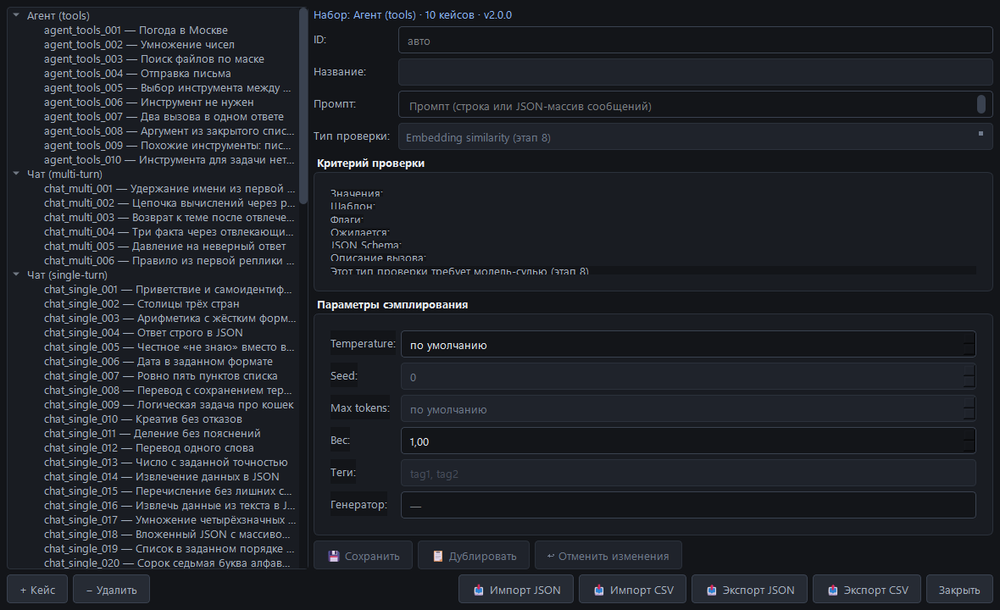

Открывается кнопкой **«Редактор»** в карточке «Наборы тестов». Набор, который
откроется, выбирается выпадашкой **«Набор для редактора»**.

**Слева** — дерево: наборы, внутри них кейсы. Клик по кейсу открывает его
справа. Кнопки под деревом:

- **«+ Кейс»** — добавить новый кейс в текущий набор;
- **«− Удалить»** — удалить выбранный кейс.

**Справа** — форма кейса:

| Поле | Что это |
|---|---|
| **ID** | идентификатор кейса (`agent_tools_001`) |
| **Название** | человекочитаемое имя |
| **Промпт** | задание для модели — строка или JSON-массив сообщений |
| **Тип проверки** | `contains_any`, `contains_all`, `not_contains`, `regex`, `exact_match`, `json_schema`, `tool_call`, `no_tool_call`, `all_of`, `word_count`, `set_equal`, а также отложенные `llm_judge` и `embedding` |
| **Критерии проверки** | поля зависят от типа: «Значения», «Шаблон», «Флаги», «Ожидается», «JSON Schema», «Описание вызова». У отложенных типов вместо полей стоит пояснение, что тип требует модель-судью |
| **Temperature / Seed / Max tokens / Вес** | параметры сэмплирования для этого кейса. «по умолчанию» — брать значения сервера |
| **Теги** | через запятую — по ним работает фильтр по тегам |
| **Генератор** | для кейсов, которые не хранят промпт, а собирают его: `speed`, `context_long` |

Кнопки внизу: **«Сохранить»**, **«Дублировать»**, **«↺ Отменить изменения»**,
**«Импорт JSON»**, **«Импорт CSV»**, **«Экспорт JSON»**, **«Экспорт CSV»**,
**«Закрыть»**.

> **Важно про `max_tokens`.** В кейсе это бюджет **ответа**. Сверху программа
> добавляет запас на рассуждение (`DEFAULT_REASONING_ALLOWANCE = 2048`, а в
> интерфейсе — поле «Запас токенов на рассуждение»). Тесный лимит даёт
> **пустой ответ** при `finish_reason=length`.
>
> И второе: **markdown-обёртка вокруг JSON — нарушение формата.** Если кейс
> проверяет JSON, ответ в тройных апострофах не пройдёт.

---

## 9. Меню

### 9.1. Файл

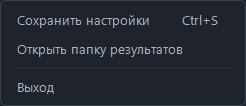

- **«Сохранить настройки»** (`Ctrl+S`) — записать текущее состояние в
  `config.json`: параметры прогона, сервер, тему, геометрию окна.
- **«Открыть папку результатов»** — открыть `results/` в проводнике.
- **«Выход»** (`Ctrl+Q`).

### 9.2. Сервис

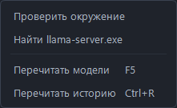

- **«Проверить окружение»** — напечатать в журнал версию Python, платформу и
  найденные копии `llama-server`.
- **«Найти llama-server.exe»** — поиск по известным местам. Не нашёл — покажет
  список проверенных мест и предложит указать путь вручную.
- **«Перечитать модели»** (`F5`).
- **«Перечитать историю»** (`Ctrl+R`).

### 9.3. Вид

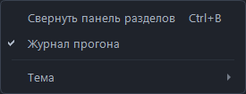

- **«Свернуть панель разделов»** (`Ctrl+B`).
- **«Журнал прогона»** — показать или скрыть полосу журнала на экране
  «Тестирование». Пункт активен только на этом экране.
- Подменю **«Тема»** — светлая, тёмная или авто.

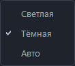

### 9.4. Справка

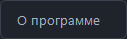

- **«О программе»** — версия и краткое описание.

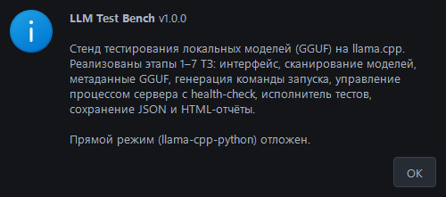

---

## 10. Темы оформления

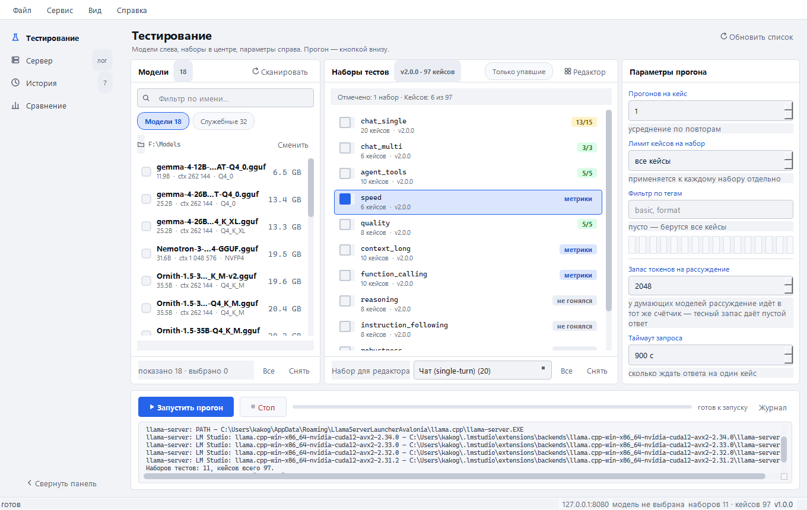

Меню **Вид → Тема**:

- **Тёмная** — оформление по умолчанию.
- **Светлая** — та же раскладка и те же роли цветов, но на светлых
  поверхностях.
- **Авто** — следовать теме системы: пока выбрано «Авто», приложение
  переключается вместе с ней.

Тема меняется **сразу, без перезапуска**, и запоминается в `config.json`
(`ui_theme`).

---

## 11. Наборы тестов

11 наборов, 97 кейсов. Версия 2.0.0 рассчитана на модели класса 35B-A3B:
базовые наборы такие модели проходят почти без ошибок, поэтому добавлены кейсы,
где расходится не знание, а дисциплина.

| Набор | Кейсов | Что проверяет |
|---|---|---|
| `chat_single` | 20 | одиночные вопросы: факты, формат, извлечение данных в JSON, точное умножение, честное «такого не бывает» |
| `chat_multi` | 6 | удержание контекста, память через отвлекающие вопросы, давление на неверный ответ, правило из первой реплики |
| `reasoning` | 8 | многошаговые цепочки, вывод порядка из условий, ловушки с лишними данными, задача без единственного ответа |
| `instruction_following` | 8 | несколько ограничений сразу: длина, формат, порядок, запреты. Проверяются все условия (`all_of`) |
| `robustness` | 6 | инструкция внутри данных, сикофантство, несуществующий метод, неполное и противоречивое задание, отказ |
| `code` | 5 | разбор чужого кода: причина падения, вывод среза, сложность, ошибка в регексе, функция по описанию |
| `agent_tools` | 10 | выбор инструмента и аргументов, два вызова в одном ответе, enum-аргумент, когда инструмент вызывать НЕ надо |
| `function_calling` | 10 | валидность вызова по JSON Schema: вложенный объект, массив, enum, необязательный аргумент, отрицание |
| `quality` | 8 | эталонные ответы по ключевым фактам |
| `context_long` | 10 | иголка в стоге 2K…128K, два похожих кода (нужно взять нужный), код по краям текста, кода нет вовсе |
| `speed` | 6 | префилл 100…32000 токенов: tokens/sec, TTFT, общее время |

Теги позволяют прогнать только часть: `hard` — самое сложное, а также
`reasoning`, `json`, `no-tool`, `basic`, `format` и другие.

> **Пропуск ≠ провал.** Отложенные проверки (`llm_judge`, `embedding`) и кейсы
> без проверок дают вердикт «пропуск» и **не идут в знаменатель** счёта.
> Набор `speed` поэтому всегда показывает «пропусков 6 из 6» — это норма, а не
> регрессия.

---

## 12. Где что лежит

| Что | Где |
|---|---|
| Результаты прогонов | `results/<модель>_<набор>_<дата>.json` |
| HTML-отчёты | `reports/<batch_id>.html` |
| Настройки | `config.json` рядом с приложением |
| Лог приложения | `logs/app.log` (ротация 2 МБ, 5 копий) |
| Лог сервера | `logs/server.log` |
| Кэш вердиктов судьи | `.cache/judge_cache.json` |
| Кэш метаданных GGUF | `.cache/` |
| База истории | `history.db` (SQLite) |
| Сессии субагента | `sessions/` |
| Задачи субагента | `agent_tasks/` |
| Наборы тестов | `tests/` |

**Про `batch_id`.** В каждом JSON прогона лежит общий идентификатор всего
запуска. По нему «История» собирает файлы одного нажатия «Запустить» в одну
строку, а «Сравнение» — в один столбец.

**Про атомарность.** Все данные пишутся через временный файл рядом и
`os.replace`. Обрыв прогона, закрытие окна или нехватка места не оставят
обрезанный JSON.

---

## 13. Настройки (`config.json`)

| Поле | По умолчанию | Что делает |
|---|---|---|
| `models_dir` | `F:\Models` | папка с `.gguf`-моделями |
| `llama_server_path` | — | путь к `llama-server.exe` |
| `tests_dir` | — | папка с наборами (по умолчанию `tests/`) |
| `results_dir` | — | папка результатов |
| `reports_dir` | — | папка отчётов |
| `logs_dir` | — | папка логов |
| `server_host` / `server_port` | `127.0.0.1` / `8080` | адрес сервера |
| `use_existing_server` | `true` | проверять внешний сервер, а не поднимать свой |
| `auto_stop_server` | `true` | останавливать свой процесс при закрытии |
| `health_check_timeout_sec` | `60` | таймаут health-check при старте |
| `default_runs` | `1` | прогонов на кейс по умолчанию |
| `default_test_types` | все типы | отмеченные наборы |
| `default_test_set` | `chat_single` | набор для редактора по умолчанию |
| `last_case_limit` | `0` | лимит кейсов (`0` — все) |
| `reasoning_allowance` | `2048` | запас токенов на рассуждение |
| `request_timeout_sec` | `900` | таймаут запроса на кейс |
| `cache_dir` | пусто → `.cache` рядом | где держать кэши |
| `warmup` | `true` | прогреть сервер одним запросом перед прогоном |
| `judge_cache` | `true` | кэшировать вердикты судьи |
| `recursive_scan` | `true` | рекурсивно сканировать папку моделей |
| `log_level` | `info` | `debug`, `info`, `warning`, `error` |
| `ui_theme` | `dark` | `dark`, `light` или `auto` |
| `ui_rail_collapsed` | `false` | свёрнут ли рельс разделов |
| `ui_run_log_open` | `true` | развёрнут ли журнал прогона |
| `window_geometry` | — | размер и положение окна |
| `history_db_name` | `history.db` | имя файла базы истории |

Правки в файле подхватываются при следующем запуске; то, что меняется из
интерфейса, сохраняется кнопкой **«Сохранить настройки»** (`Ctrl+S`) или при
закрытии окна.

---

## 14. Частые ситуации и что с ними делать

| Ситуация | Что происходит / что делать |
|---|---|
| **Порт занят перед запуском** | Появится диалог: «Освободить / Выбрать другой / Пропустить модель» |
| **Перед стартом спросили «Продолжить прогон?»** | На сервере идёт посторонний запрос: `/slots` показал `is_processing` или между двумя пробами сменился `id_task`. У сборки один слот, поэтому чужой запрос встаёт впереди наших, и скорости показывают скорость очереди, а не модели — первым врёт скорость префилла. «Продолжить» — прогон идёт, факт занятости пишется в `params.server_busy` прогона; «Отмена» — прогон не стартует |
| **Предупреждения о занятости нет, хотя сервер чем-то занят** | Сборка собрана без `--slots`, или эндпоинт не ответил. Приложение в этом случае молчит: «не удалось спросить» и «свободен» — разные вещи, выдумывать занятость оно не будет |
| **Сервер упал во время теста** | Авто-повтор: перезапуск и повтор последнего прогона (1 раз) |
| **Сервер не отвечает на health** | Процесс убивается, модель помечается `failed`, прогон идёт дальше |
| **VRAM не освободилась после модели** | Запись в лог, пауза 5 секунд и повторная проверка (до 3 раз) |
| **Нажали «Стоп»** | Текущий кейс завершается, сервер останавливается, частичные результаты сохраняются |
| **Программа вырубилась с горящим сервером** | При старте она убьёт осиротевший `llama-server.exe` по PID из `config.json` |
| **В отчёте «Память модели: нет данных»** | Сервер поднят не приложением (стоит галочка «Использовать существующий сервер») или в команде запуска нет `-v`. Это не сбой — цифры по HTTP не отдаются, только в stdout при загрузке |
| **В отчёте есть буферы, но нет раскладки слоёв** | Сервер запущен с `-lv 4` вместо `-v`: построчную раскладку `llama.cpp` печатает только на уровне debug |
| **Кейс вернул пустой ответ** | Проверьте «Запас токенов на рассуждение»: у «думающих» моделей рассуждение идёт в тот же счётчик, и тесный запас обрезает ответ на `finish_reason=length`. Пустой ответ — это **провал** при любой проверке |
| **В логе «судья: из кэша 0, спрошено заново N»** | Первый прогон с судьёй — кэш ещё пуст. При повторном прогоне тех же ответов число попаданий должно вырасти. Если нет — проверьте, что `judge_cache` не выключен |
| **Счёт в наборе — прочерк «—»** | В наборе нет проверок (например, `speed`). Судить нужно по метрикам в отчёте |

---

## 15. Горячие клавиши

| Клавиши | Действие |
|---|---|
| `Ctrl+S` | Сохранить настройки |
| `Ctrl+Q` | Выход |
| `F5` | Перечитать модели |
| `Ctrl+R` | Перечитать историю |
| `Ctrl+B` | Свернуть или развернуть панель разделов |

---

## 16. Прогон из консоли (альтернатива окну)

Для пакетного прогона наборов против **уже запущенного** сервера есть
`run_tests.py`:

```bat
Прогнать-тесты.bat chat_single
Прогнать-тесты.bat chat_single --runs 2 --report
Прогнать-тесты.bat speed,chat_multi --report
Прогнать-тесты.bat chat_single --dry-run
```

Аргументы:

| Аргумент | Значение |
|---|---|
| `--set <набор, через запятую или all>` | обязательный |
| `--runs <N>` | сколько повторов каждого кейса (по умолчанию 1) |
| `--limit <N>` | взять только первые N кейсов каждого набора |
| `--tags <basic,format>` | только кейсы с этими тегами |
| `--report` | собрать HTML-отчёт сразу после прогона |
| `--dry-run` | собрать промпты и посчитать токены, ничего не отправляя |
| `--reasoning-allowance <N>` | запас токенов на рассуждение |
| `--base-url <url>` | адрес сервера (по умолчанию из `config.json`) |
| `--timeout <сек>` | таймаут запроса (по умолчанию 900) |
| `--server-command "<команда>"` | чем поднят сервер — для записи в прогон |

`--dry-run` полезен, чтобы проверить, что промпты собираются, ничего не
отправляя в сервер.

> **Чем поднят сервер — в `params.server`.** Скорость решают не только модель и
> набор, но и флаги запуска: `--load-mode`, `-ot`, `--n-cpu-moe` меняют, где
> лежат веса, и разница в 25% на генерации — обычное дело. Поэтому каждый
> прогон записывает три факта: `applied` (поднимало ли приложение процесс этой
> командой), `command` (команда как есть; пустая строка — «неизвестна») и
> `note` (почему пустая). Ключ есть **всегда**, в том числе когда команда
> неизвестна: молчание читалось бы как «это не важно». Консоль сервером не
> управляет, поэтому команду ей передают снаружи — флагом `--server-command`.

---

## 17. Проверки проекта (для разработчика)

Живой `llama-server` не нужен ни одной проверке.

```bat
.venv\Scripts\python.exe check_all.py            # все проверки одной сводкой
.venv\Scripts\python.exe check_all.py --fast     # без GUI-блока
.venv\Scripts\python.exe make_screenshots.py             # снимки разделов в docs/
.venv\Scripts\python.exe make_screenshots.py --manual    # снимки руководства в docs/manual/
```

Один вход на всё — `check_all.py`: тринадцать проверок плюс `ruff check` и
`ruff format --check`. `--list` показывает состав, можно назвать конкретные
скрипты.

---

*Руководство описывает версию 1.0.0. Снимки экрана сделаны на этой же версии
командой `make_screenshots.py --manual`.*
